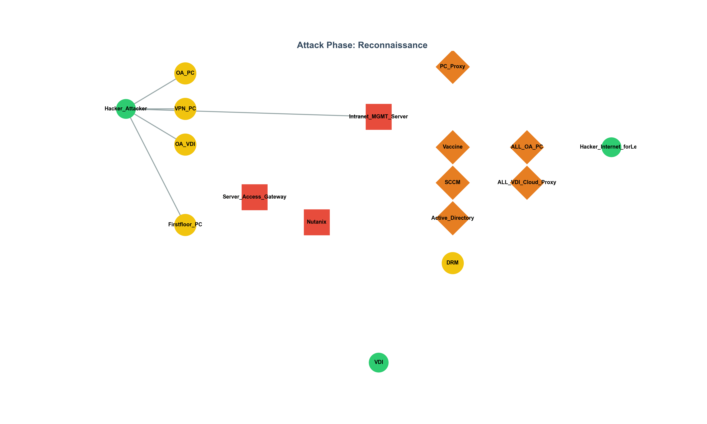

# spofInCybersecurity

# 🔥 SPOF Mapping and Visualization in Cybersecurity

> A graph-based methodology for identifying and prioritizing **Single Points of Failure (SPOFs)** in real-world infrastructures — with support for visualization, animation, and LLM-assisted modeling.

---

## 📌 Overview

In cybersecurity, not all infected nodes are critical. This project demonstrates how SPOFs — components that, if compromised, can cause disproportionate impact — can be identified **structurally** rather than **symptomatically**.

We model a real-world infrastructure into a `graph.json` file, representing stages such as:

1. **Reconnaissance**
2. **Initial Access**
3. **Terminal Access**
4. **Malware Infection**
5. **Command and Control**

Then, using graph traversal and weighted centrality analysis, we identify SPOF candidates, simulate their removal, and visualize how the attack paths are affected.

---

## 🔍 Key Features

- **Weighted SPOF Analysis**: Takes into account both path frequency and node importance (e.g., cost of protection).
- **Graph Stage Modeling**: Attack progression split into multiple logical stages.
- **Structural vs. Observational Impact**: Distinguishes between frequently infected nodes and truly critical nodes.
- **Support for Custom Node Weights**: Model business/financial impact explicitly.
- **Graph Visualization**: Static and animated visualizations of attack paths.
- **SPOF Report Generation**: JSON and CLI output with absolute/relative/redundant/low categories.
- **GIF/Video Output**: Visuals suitable for embedding in reports or sharing on social platforms.
- **LLM-friendly Input Format**: Designed for semi-automated generation using large language models from logs, rules, or documents.

---

## 📁 Files

| File                     | Purpose                                                              |
|--------------------------|----------------------------------------------------------------------|
| `graph.json`             | Graph structure, stages, and node weights                            |
| `spof_result.json`       | SPOF level classification per node (generated by analyzer)           |
| `calc_spof_from_json.py` | SPOF analyzer: computes node frequency, weighted impact, and levels  |
| `visualize_spof.py`      | Generates visualization (static PNG, animated GIF/MP4)               |

---

## 🚀 How to Use

### 1. Install dependencies

```bash
pip install networkx matplotlib pygraphviz
brew install graphviz  # or apt install graphviz
````

> ⚠️ `pygraphviz` may require environment variables for build. If needed:

```bash
export CFLAGS="-I/opt/homebrew/include/graphviz"
export LDFLAGS="-L/opt/homebrew/lib"
```

### 2. Run SPOF Analysis

```bash
python calc_spof_from_json.py
```

* Outputs `spof_result.json`
* Shows top SPOF nodes by weighted centrality
* Classifies nodes as: `absolute`, `relative`, `redundant`, or `low`

### 3. Visualize the Graph

```bash
python visualize_spof.py
```

* Generates:

  * `spof_static_terminal.png` (static layout with node coloring, edge stages, SPOF levels)
  * `spof_animation.gif` (animated stage-wise attack flow)
  * `spof_animation.webm` (for embedding in HTML)

---

## 🎯 Example Output

<p align="center">
  
</p>

---

## 📊 Sample Result (from `spof_result.json`)

```json
{
  "Intranet_MGMT_Server": "absolute",
  "Server_Access_Gateway": "absolute",
  "Nutanix": "absolute",
  "Vaccine": "relative",
  "SCCM": "relative",
  "Active_Directory": "relative",
  "PC_Proxy": "relative",
  "ALL_OA_PC": "relative",
  "ALL_VDI_Cloud_Proxy": "relative"
}
```

---

## 🧠 Use Cases

* **Security Budget Planning**: Prioritize investment not by infection frequency, but structural importance.
* **Penetration Testing**: Map attack vectors and simulate damage by removing nodes.
* **Infrastructure Refactoring**: Detect latent SPOFs before incidents.
* **LLM Integration**: Convert unstructured docs (e.g., firewall rules, flow logs) to `graph.json` via GPT or other models.

---

## 📎 Related Posts

* [LinkedIn Post: SPOF in Cybersecurity (Korean)](https://www.linkedin.com/) *(coming soon)*
* [Blog Post: SPOF in Cybersecurity (English)](https://windshock.github.io/en/post/2025-05-15-spof-analysis-in-cybersecurity/)
* [Blog Post: SPOF in Cybersecurity (Korean)](https://windshock.github.io/ko/post/2025-05-15-spof-analysis-in-cybersecurity/)
* [Animated Thread on X (Twitter)](https://twitter.com/) *(coming soon)*

---

## 🏷️ Tags

`#CyberSecurity` `#SPOF` `#GraphAnalysis` `#AIinSecurity` `#NetworkArchitecture`
`#SecurityBudget` `#SKT` `#LLM` `#GraphViz` `#InfraSecurity`

---

## 🧑‍💻 Author

Hyeongkwan Lee · [`@windshock`](mailto:windshock@gmail.com) · [windshock.github.io](https://windshock.github.io)

---

## 📄 License

MIT
